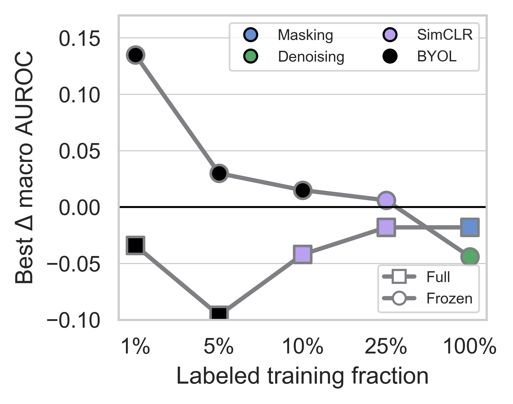
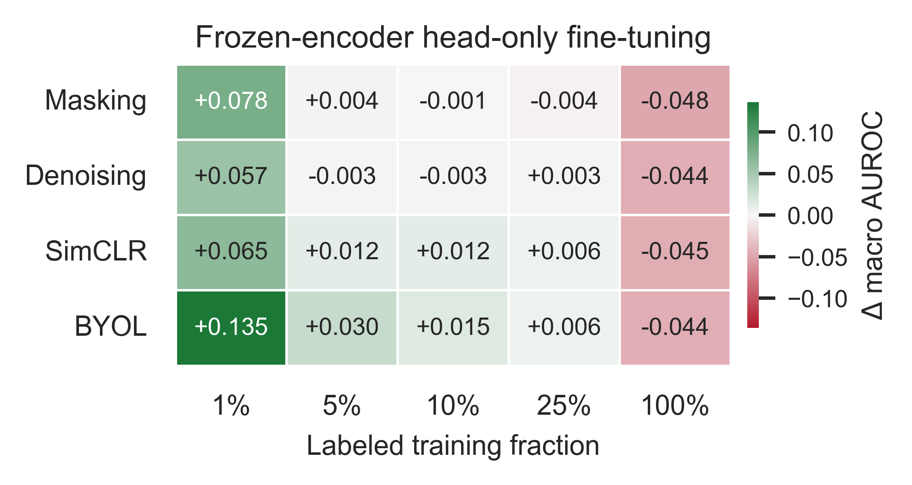
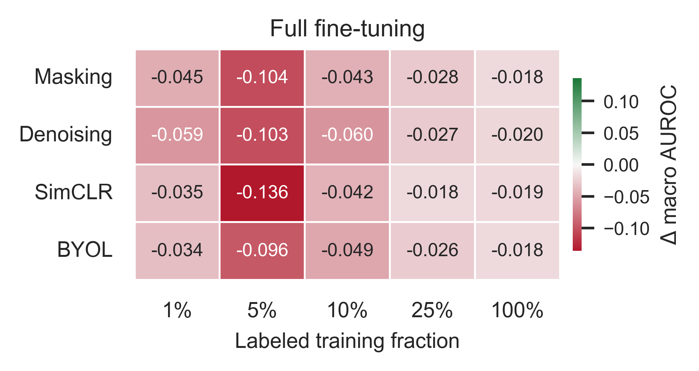

# Self-Supervised ECG Pretraining Under Data and Model Constraints

## Overview

Foundation-scale ECG pretraining works, but its data and compute requirements are out of reach in many research settings. Our asks a narrower question: **which benefits of the pretrain-and-adapt paradigm survive when pretraining is deliberately restricted to one public dataset, one backbone, and one downstream task?**

We run a controlled comparison of four self-supervised objectives for 12-lead ECG diagnostic classification on the PTB-XL dataset:

| SSL Pretraining Objective | Pretraining signal |
| --- | --- |
| **Masking** | Recover zeroed-out temporal patches |
| **Denoising** | Recover clean signal from Gaussian-corrupted input |
| **SimCLR** | NT-Xent contrastive loss over two augmented views |
| **BYOL** | Online network predicts EMA target network's projection |

Every method shares the same `xresnet1d101` backbone, data split, input pipeline, downstream task, label-fraction schedule, and evaluation protocol. The only things that vary are the **SSL objective** and the **downstream adaptation protocol** (full model fine-tuning vs. frozen encoder with head-only training).


## Headline finding

Under data and model constraints, SSL initialization does *not* reliably beat a strong supervised baseline when the entire model is fine-tuned. The gains appear when the pretrained encoder is **frozen** and only the classifier head is trained.

At 1% labels, every frozen SSL encoder outperforms the baseline. In scarce-label conditions, switching the adaptation protocol appears to matter more than switching the SSL pretraining objective.

<br> <p align="center">
    
    <br> <sub> Best-performing SSL method within each adaptation protocol at each label fraction, shown as mean macro AUROC gain relative to the supervised baseline. Marker shape indicates the adaptation protocol and marker color indicates the SSL pretraining objective. </sub>
</p> <br>

Refer to the **Results** section for more details.


## Repository structure

```
.
├── dataset.py                    # PTB-XL dataset loading, label construction, splits, crops, and corruptions
├── model.py                      # xresnet1d101 backbone, reconstruction autoencoders, SimCLR, and BYOL models
├── loss.py                       # reconstruction loss, NT-Xent loss, and symmetric BYOL loss
├── utils.py                      # seeding, dataloaders, safe macro AUROC, encoder weight loading
├── utils_training.py             # shared downstream trainer (full/head-only), and chunked inference
├── train_baseline.py             # supervised-from-scratch baseline across all label fractions
├── train_reconstruction.py       # masking/denoising pretraining and downstream training
├── train_contrastive_simclr.py   # SimCLR pretraining and downstream training
├── train_contrastive_byol.py     # BYOL pretraining and downstream training
├── requirements.txt
└── kaggle notebooks/             # executed run records for every method × seed (see below)
    ├── {mask,denoise,simclr,byol}_seed{22,54,71}.ipynb
    ├── baseline_seed{22,54,71}.{ipynb,log}
    └── Macro AUROC performance scores.xlsx
```


### `kaggle notebooks/`

These are the actual execution records for the runs reported in the paper, kept for transparency rather than as a re-entry point. Each notebook clones this repository, installs `wfdb`, invokes one training script with one seed, and zips the resulting output directory; the stored cell outputs contain the full per-epoch training logs for that run. `baseline_seed22` was run locally instead of on Kaggle, so its log is checked in as a plain `.log` file. `Macro AUROC performance scores.xlsx` holds the per-seed test macro AUROC values together with the mean ± SD aggregation reported in Table 1.


## Setup

Python version 3.12.12 was used for the experiments.

```bash
git clone https://github.com/deepshiksharma/ptbxl-ssl-objectives.git
cd ptbxl-ssl-objectives

python -m venv .venv && source .venv/bin/activate   # alternatively, conda
pip install -r requirements.txt
```

Each SSL method runs 100 pretraining epochs, followed by 10 downstream runs (5 label fractions × 2 adaptation protocols) of 50 epochs each.

The reported results are of 15 such runs in total (4 methods × 3 seeds, plus 3 baseline seeds).


### Dataset

Download the **100 Hz** version of [PTB-XL](https://physionet.org/content/ptb-xl/) (v1.0.3) from PhysioNet. The loader needs `ptbxl_database.csv`, `scp_statements.csv`, and the `records100/` waveform directory referenced by the `filename_lr` column.

The data path is currently set as a constant near the top of each training script:
```python
DATA_DIR = "/kaggle/input/datasets/deepshiksharma/ptb-xl-100hz/ptb-xl_100hz"
```
Point this at your PTB-XL directory path before running.

Note: On first use, `load_ptbxl_raw100()` reads all 21,837 records with `wfdb` and caches them as a single `raw100.npy` array (~1 GB float32) so later runs skip the per-record read. `cache_dir` defaults to `/kaggle/working` and should also be changed for local use.


## Reproducing the experiments

Run from the repository root. Each script takes the seed value as its final argument. The paper uses seeds **22, 54, 71**.

```bash
# supervised scratch baseline (full fine-tuning only)
python train_baseline.py 22

# reconstruction objectives
python train_reconstruction.py mask 22
python train_reconstruction.py denoise 22

# discriminative objectives
python train_contrastive_simclr.py 22
python train_contrastive_byol.py 22
```

Repeat for seeds `54` and `71`. Each script writes one self-contained output directory and is safe to run independently of the others.

SSL pretraining and the two downstream protocols can be toggled via the `RUN_PRETRAIN` / `RUN_FULL_FINETUNE` / `RUN_HEAD_ONLY_FINETUNE` flags at the top of the file.


### Output structure

```
byol_seed22/
├── config.json                       # resolved hyperparameters for the run
├── all_metrics.json                  # every downstream result from this run
├── pretrain/
│   ├── pretrain_last.pt              # encoder state dict (head excluded), full model, history
│   └── pretrain_history.csv          # per-epoch SSL loss
├── finetune_full/
│   └── {001,005,010,025,100}pct/
│       ├── best_model.pt             # best-val checkpoint, metrics, history
│       ├── metrics.json              # best/final val and test macro AUROC
│       ├── history.csv               # per-epoch loss, val AUROC, LR
│       ├── train_subset_indices.npy  # exact labeled subset used
│       ├── {val,test}_preds.npy
│       └── {val,test}_per_class_auc.npy
└── finetune_head/
    └── {001,005,010,025,100}pct/     # same as for finetune_full/
```

## Experimental configuration

| | |
| --- | --- |
| Dataset | PTB-XL 100 Hz, diagnostic multilabel task (44 labels) |
| Split | Official PTB-XL folds: 1–8 train (17,441), 9 val (2,193), 10 test (2,203) |
| Backbone | `xresnet1d101`, expansion 4, layers [3, 4, 23, 3], kernel size 5, ~1.8 M encoder parameters |
| Embedding | Adaptive concat (max + avg) pooling → 512-d |
| Head | BN → dropout(0.5) → 512×128 → ReLU → BN → dropout → 128×44 |
| Input (train) | One random 2.5 s crop per record → `(12, 250)` |
| Input (eval) | Overlapping 2.5 s chunks, stride 125; record-level score = per-class max over chunks |
| Label fractions | 1%, 5%, 10%, 25%, 100% (seeded permutation of the training folds) |
| Metric | Test macro AUROC over 44 labels; classes absent from a split are skipped via `nanmean` |
| Model selection | Highest validation macro AUROC checkpoint |
| Seeds | 22, 54, 71 — results reported as mean ± SD |
| Optimization | AdamW with a OneCycle schedule throughout.

| Stage | Epochs | Batch | LR | Weight decay |
| --- | --- | --- | --- | --- |
| SSL pretraining | 100 | 128 | 1e-3 | 1e-4 |
| Full fine-tuning (pretrained) | 50 | 128 | 1e-3 | 1e-2 |
| Head-only fine-tuning | 50 | 128 | 1e-2 | 1e-2 |
| Supervised baseline | 50 | 128 | 1e-2 | 1e-2 |

Note: The higher head-only learning rate exists to let a randomly initialized head converge on top of a frozen encoder.

---

### Pretraining objective details

- **Masking**: 250-sample crops split into 10 non-overlapping patches of 25; 50% of patches zeroed across all 12 leads; smooth L1 reconstruction loss computed **only over masked positions**. Decoder is a 4-layer 1-D conv stack on top of linearly upsampled encoder features.
- **Denoising**: Additive Gaussian noise (σ = 0.075) over all leads and timepoints; loss computed over the full crop. Optional lead dropout is available but disabled (`denoise_lead_dropout_prob = 0.0`).
- **SimCLR / BYOL**: Identical two-view augmentation pipeline, applied in a fixed order. Amplitude scaling (0.8–1.2), temporal shift (±25 samples, zero fill), Gaussian noise (σ = 0.05), temporal patch masking (20% of patches), lead dropout (p = 0.15). SimCLR uses NT-Xent at temperature 0.2; BYOL uses the symmetric negative-cosine loss with EMA momentum 0.996, updating target buffers as well as parameters.

Pretraining uses just the signal waveforms. No labels are touched.


## Results

Test macro AUROC, mean ± SD over three seeds. "Full" is full model fine-tuning; "Frozen" is head-only training on a frozen encoder.

| Method | Fine-tuning | 1% | 5% | 10% | 25% | 100% |
| --- | --- | --- | --- | --- | --- | --- |
| Baseline | Full | 0.636 ± 0.019 | 0.794 ± 0.013 | 0.823 ± 0.005 | 0.852 ± 0.015 | **0.927 ± 0.003** |
| Masking | Full | 0.591 ± 0.018 | 0.690 ± 0.040 | 0.780 ± 0.018 | 0.824 ± 0.008 | 0.909 ± 0.004 |
| | Frozen | 0.714 ± 0.030 | 0.798 ± 0.011 | 0.822 ± 0.018 | 0.848 ± 0.005 | 0.879 ± 0.002 |
| Denoising | Full | 0.577 ± 0.025 | 0.691 ± 0.016 | 0.763 ± 0.003 | 0.825 ± 0.010 | 0.907 ± 0.004 |
| | Frozen | 0.693 ± 0.020 | 0.791 ± 0.010 | 0.820 ± 0.010 | 0.855 ± 0.008 | 0.883 ± 0.008 |
| SimCLR | Full | 0.601 ± 0.041 | 0.658 ± 0.018 | 0.781 ± 0.017 | 0.834 ± 0.012 | 0.908 ± 0.005 |
| | Frozen | 0.701 ± 0.009 | 0.806 ± 0.021 | 0.835 ± 0.010 | **0.858 ± 0.010** | 0.882 ± 0.002 |
| BYOL | Full | 0.602 ± 0.014 | 0.698 ± 0.021 | 0.774 ± 0.029 | 0.826 ± 0.003 | 0.909 ± 0.005 |
| | Frozen | **0.771 ± 0.014** | **0.824 ± 0.010** | **0.838 ± 0.003** | **0.858 ± 0.010** | 0.883 ± 0.007 |

<br> <p align="center">
<table align="center">
  <tr>
    <td align="center">
      
    </td>
    <td align="center">
      
    </td>
  </tr>
  <tr>
    <td align="center" colspan="2">
      <sub> Difference in mean test macro AUROC relative to the supervised scratch baseline. Positive values indicate higher mean performance than supervised training from random initialization,while negative values indicate lower mean performance. </sub>
    </td>
  </tr>
</table>
</p> <br>

Note: These experiments did not measure representation drift, so the weak full model fine-tuning results are consistent with overfitting or overwriting of pretrained features rather than evidence for either mechanism. Conclusions are limited to PTB-XL diagnostic classification with `xresnet1d101`. Cross-dataset transfer, additional downstream tasks, and larger architectures are not evaluated.

---

## Acknowledgements

The backbone and input/inference protocol follow the PTB-XL benchmark of [Strodthoff et al. (2021)](https://doi.org/10.1109/JBHI.2020.3022989), used here as a fixed, established reference point rather than a new architecture. PTB-XL is made available by [Wagner et al. (2020)](https://doi.org/10.1038/s41597-020-0495-6) via PhysioNet.

If you use PTB-XL, please also cite Wagner et al. (2020), and Strodthoff et al. (2021) for the benchmark protocol and the `xresnet1d101` implementation this work builds on.
